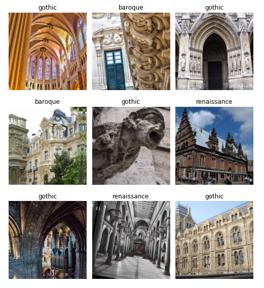
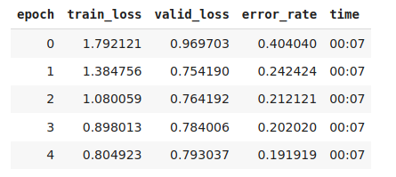

# architecture_styles

Model performed with __fastai__ library (v1).

Model trained using custom dataset created collecting images from Google. The dataset contains 200 pictures for each of the 3 architecture styles:
- Baroque
- Gothic
- Renaissance

- Results: With resnet34 as the architecture chosen, our model got an accuracy of 80.81%.

_error_rate showed instead (error_rate = 1 - accuracy)._
